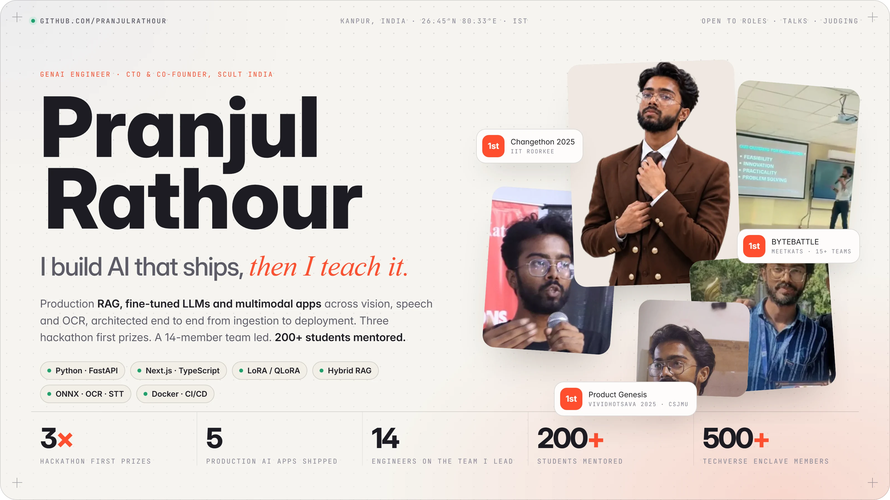
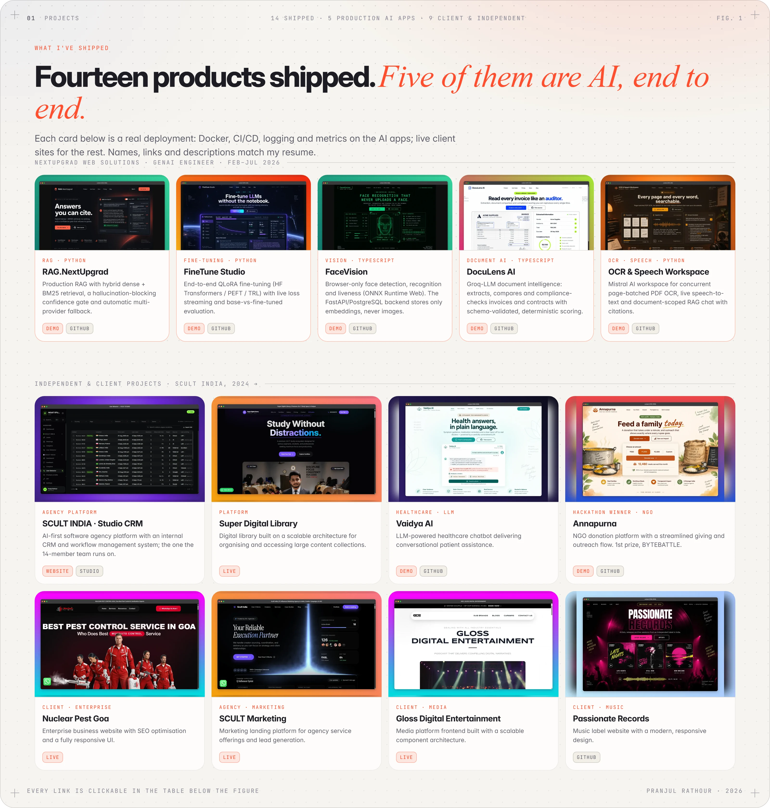
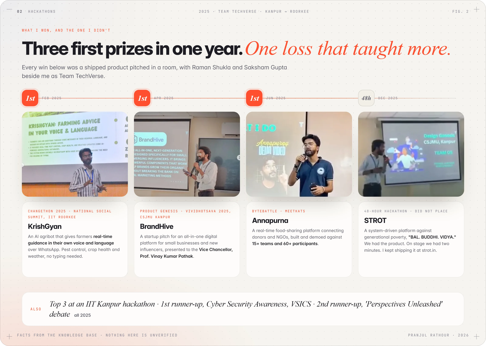
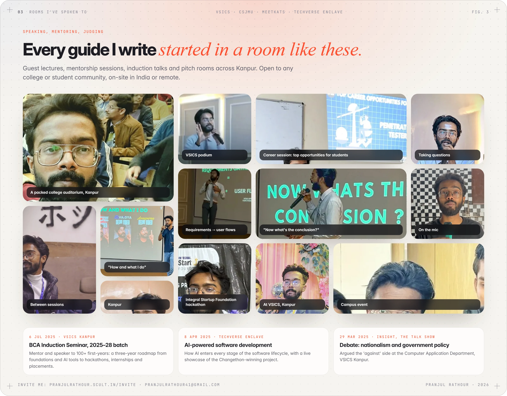
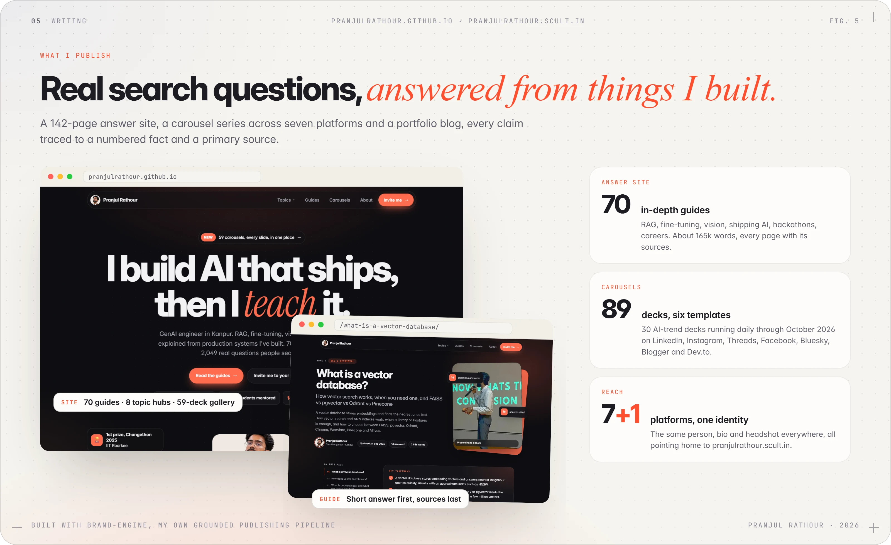
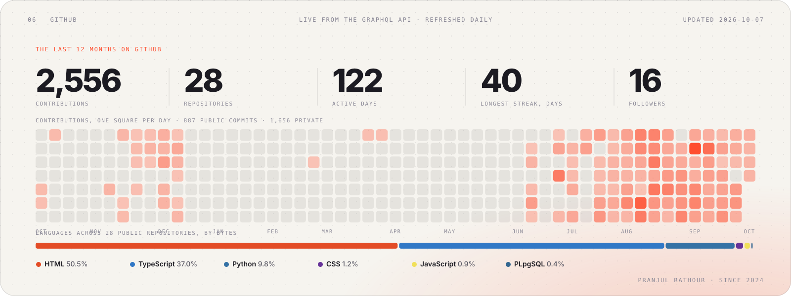
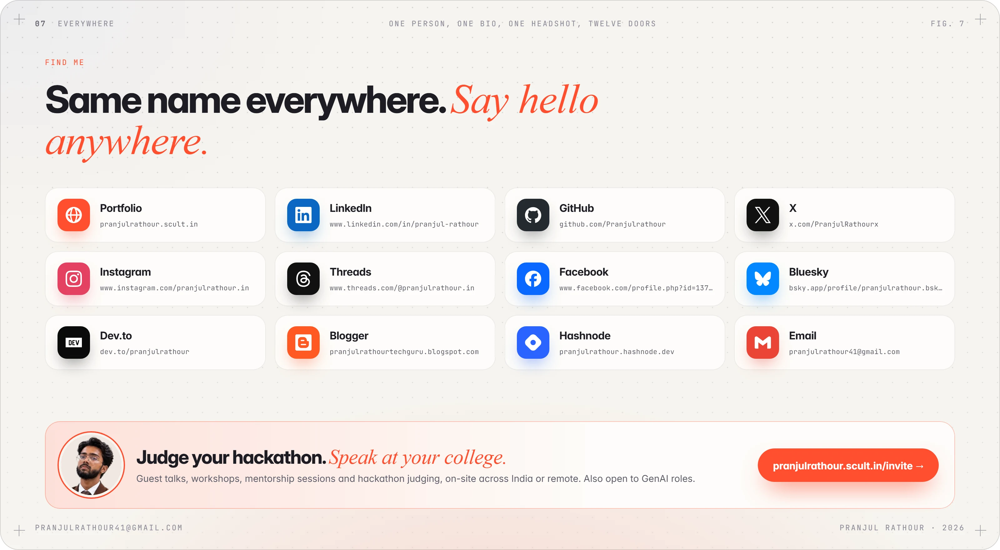

<!-- Designed in HTML, rendered to WebP by scripts/render.py. Light and dark variants swap with <picture>. Every number comes
     from the resume and knowledge base in brand-engine; GitHub figures redraw daily via .github/workflows/refresh.yml. -->
<a href="https://pranjulrathour.scult.in"><picture>
<source media="(prefers-color-scheme: dark)" srcset="assets/hero-dark.webp">

</picture></a>

<picture>
<source media="(prefers-color-scheme: dark)" srcset="assets/typing-dark.svg">

</picture>

<a href="https://pranjulrathour.scult.in"><picture><source media="(prefers-color-scheme: dark)" srcset="assets/icons/dark/globe.svg"></picture></a>&nbsp;&nbsp;&nbsp;
<a href="https://www.linkedin.com/in/pranjul-rathour/"><picture><source media="(prefers-color-scheme: dark)" srcset="assets/icons/dark/linkedin.svg"></picture></a>&nbsp;&nbsp;&nbsp;
<a href="https://x.com/PranjulRathourx"><picture><source media="(prefers-color-scheme: dark)" srcset="assets/icons/dark/x.svg"></picture></a>&nbsp;&nbsp;&nbsp;
<a href="https://www.instagram.com/pranjulrathour.in/"><picture><source media="(prefers-color-scheme: dark)" srcset="assets/icons/dark/instagram.svg"></picture></a>&nbsp;&nbsp;&nbsp;
<a href="https://www.threads.com/@pranjulrathour.in"><picture><source media="(prefers-color-scheme: dark)" srcset="assets/icons/dark/threads.svg"></picture></a>&nbsp;&nbsp;&nbsp;
<a href="https://www.facebook.com/profile.php?id=1377591238763842"><picture><source media="(prefers-color-scheme: dark)" srcset="assets/icons/dark/facebook.svg"></picture></a>&nbsp;&nbsp;&nbsp;
<a href="https://bsky.app/profile/pranjulrathour.bsky.social"><picture><source media="(prefers-color-scheme: dark)" srcset="assets/icons/dark/bluesky.svg"></picture></a>&nbsp;&nbsp;&nbsp;
<a href="https://dev.to/pranjulrathour"><picture><source media="(prefers-color-scheme: dark)" srcset="assets/icons/dark/devdotto.svg"></picture></a>&nbsp;&nbsp;&nbsp;
<a href="https://pranjulrathourtechguru.blogspot.com/"><picture><source media="(prefers-color-scheme: dark)" srcset="assets/icons/dark/blogger.svg"></picture></a>&nbsp;&nbsp;&nbsp;
<a href="https://pranjulrathour.hashnode.dev"><picture><source media="(prefers-color-scheme: dark)" srcset="assets/icons/dark/hashnode.svg"></picture></a>&nbsp;&nbsp;&nbsp;
<a href="mailto:pranjulrathour41@gmail.com"><picture><source media="(prefers-color-scheme: dark)" srcset="assets/icons/dark/gmail.svg"></picture></a>

<a href="#-projects"><b>Projects</b></a> &nbsp;·&nbsp; <a href="#-hackathons"><b>Hackathons</b></a> &nbsp;·&nbsp; <a href="#-speaking"><b>Speaking</b></a> &nbsp;·&nbsp; <a href="#-stack"><b>Stack</b></a> &nbsp;·&nbsp; <a href="#-writing"><b>Writing</b></a> &nbsp;·&nbsp; <a href="#-github"><b>GitHub</b></a> &nbsp;·&nbsp; <a href="#-find-me"><b>Find me</b></a>

 

**GenAI engineer and AI product builder, 2+ years shipping production-grade AI systems:** RAG pipelines, fine-tuned LLMs, hybrid retrieval and multimodal apps across vision, speech and OCR, architected end to end from ingestion to deployment. I lead engineering for the 14-member team at [SCULT INDIA](https://scult.in), where I'm CTO & co-founder, and I founded [TechVerse Enclave](https://www.linkedin.com/in/pranjul-rathour/), a 500+ member developer community. BCA at Dr. Virendra Swarup Institute of Computer Studies, Kanpur, 2023–2026.

> [!TIP]
> **Open to GenAI roles, hackathon judging, mentorship sessions and guest talks at colleges**, on-site across India or remote. The fastest route is email: **pranjulrathour41@gmail.com**, or [pranjulrathour.scult.in/invite](https://pranjulrathour.scult.in/invite).

 

## ◆ Projects

<picture>
<source media="(prefers-color-scheme: dark)" srcset="assets/projects-dark.webp">

</picture>

**NextUpgrad Web Solutions, GenAI engineer, Feb–Jul 2026.** Five production AI applications designed, built and shipped end to end, each deployed with Docker, CI/CD and observability.

| Project | What it does | Links |
|---|---|---|
| **RAG.NextUpgrad** | Production RAG with hybrid dense + BM25 retrieval, a hallucination-blocking confidence gate and automatic multi-provider fallback. Streams citation-grounded answers; runs in about 220 MB on a free tier. | [Demo](https://lnkd.in/p/gyQSx2Z2) · [GitHub](https://github.com/Pranjulrathour/RAG.NEXTUPGRAD) |
| **FineTune Studio** | End-to-end QLoRA fine-tuning (Hugging Face Transformers / PEFT / TRL) with live loss streaming and side-by-side base-vs-fine-tuned evaluation. | [Demo](https://lnkd.in/p/ghD2xquX) · [GitHub](https://github.com/Pranjulrathour/FINETUNESTUDIO) |
| **FaceVision** | Browser-only face detection, recognition and liveness check with ONNX Runtime Web. The FastAPI/PostgreSQL backend stores only vector embeddings, never images. | [Demo](https://lnkd.in/p/gJCZiZdt) · [GitHub](https://github.com/Pranjulrathour/FACEVISION-NEXTUPGRAD-) |
| **DocuLens AI** | Groq-LLM document intelligence: extracts, compares and compliance-checks invoices and contracts with schema-validated, deterministic scoring. | [Demo](https://lnkd.in/p/gZQVYFqm) · [GitHub](https://github.com/Pranjulrathour/DOCULENS-AI-NEXTUPGRAD-) |
| **OCR & Speech Workspace** | Mistral AI workspace for concurrent page-batched PDF OCR, live speech-to-text and document-scoped RAG chat with citations. | [Demo](https://lnkd.in/p/gXz4Smby) · [GitHub](https://github.com/Pranjulrathour/OCR-STT-NEXTUPGRAD-mistral.ai-) |

**Independent and client projects, SCULT INDIA, 2024 to present.** 5+ paid, production-grade products shipped for clients across industries; about ₹1,00,000 revenue in the first six months.

| Project | What it does | Links |
|---|---|---|
| **SCULT INDIA · Studio CRM** | AI-first software agency platform with an internal CRM and workflow management system; the one the whole team runs on. | [Website](https://scult.in/) · [Studio](https://studio.scult.in/) · [Demo](https://www.instagram.com/reel/DazuEzohKog/) |
| **Super Digital Library** | Digital library built on a scalable architecture for organising and accessing large content collections. | [Live](https://superdigitallibrary.vercel.app/) · [Demo](https://www.instagram.com/reel/Da7RzLrxSK4/) |
| **Vaidya AI** | LLM-powered healthcare chatbot delivering conversational patient assistance. | [GitHub](https://github.com/Pranjulrathour/VAIDYA.ai) · [Demo](https://www.instagram.com/reel/DK7o-MYNzBX/) |
| **Annapurna** | NGO donation platform with a streamlined giving and outreach flow. 1st prize, BYTEBATTLE. | [GitHub](https://github.com/Pranjulrathour/annapurna.live) · [Demo](https://www.instagram.com/reel/DKRpJv_B4tu/) |
| **Nuclear Pest Goa** | Enterprise business website with SEO optimisation and a fully responsive UI. | [Live](https://www.nuclearpestgoa.in/) · [Demo](https://lnkd.in/p/gr7JfnU8) |
| **SCULT Marketing** | Marketing landing platform for agency service offerings and lead generation. | [Live](https://marketing.scult.in/) · [Demo](https://lnkd.in/p/gg3f3WWc) |
| **Gloss Digital Entertainment** | Media platform frontend built with a scalable component architecture. | [Live](https://www.glossdigitalentertainment.in/) · [Demo](https://www.instagram.com/reel/DJSVmrMT5TI/) |
| **Passionate Records** | Music label website with a modern, responsive design. | [GitHub](https://github.com/Pranjulrathour/passionate-records) |
| **STROT** | Built in a 48-hour hackathon, Dec 2025: a system-driven platform against generational poverty. Didn't place; kept shipping it. | [GitHub](https://github.com/Pranjulrathour/strot.in) |

 

## ◆ Hackathons

<picture>
<source media="(prefers-color-scheme: dark)" srcset="assets/wins-dark.webp">

</picture>

| | Event | Built | With |
|:-:|---|---|---|
| 🥇 | **Changethon 2025**, National Social Summit, IIT Roorkee · Feb 2025 | **KrishGyan**: an AI agribot giving farmers real-time guidance in their own voice and language over WhatsApp | Team TechVerse: Raman Shukla, Saksham Gupta |
| 🥇 | **Product Genesis**, Vividhotsava 2025, CSJMU Kanpur · Apr 2025 | **BrandHive**: a startup pitch for an all-in-one digital platform for small businesses and emerging influencers, presented to Vice Chancellor Prof. Vinay Kumar Pathak | Team TechVerse |
| 🥇 | **BYTEBATTLE**, MeetKats · Jun 2025 | **Annapurna**: a real-time food-sharing platform connecting donors and NGOs, against 15+ teams and 60+ participants | Team TechVerse |
| 🏅 | **Top 3**, IIT Kanpur hackathon · 1st runner-up, Cyber Security Awareness, VSICS · 2nd runner-up, 'Perspectives Unleashed' debate, VSICS | | 2025 |

 

## ◆ Speaking

<picture>
<source media="(prefers-color-scheme: dark)" srcset="assets/wall-dark.webp">

</picture>

| Date | Session | Where |
|---|---|---|
| 6 Jul 2025 | **BCA Induction Seminar, 2025–28 batch**: mentor and speaker to 100+ first-year students on a three-year roadmap, from foundations and AI tools to hackathons, internships and placements | VSICS, Kanpur |
| 8 Apr 2025 | **AI-powered software development**: how AI enters every stage of the software lifecycle, with a live showcase of the Changethon-winning project | VSICS Kanpur, under TechVerse Enclave |
| 29 Mar 2025 | **INSIGHT, The Talk Show**: debate on nationalism and government policy in India, arguing the 'against' side | Computer Application Department, VSICS Kanpur |

Also on YouTube for students: a TCS CodeVita 2025 registration and preparation playlist, and a "full-stack AI app in 30 minutes" build with the PRD shared.

 

## ◆ Stack

<picture>
<source media="(prefers-color-scheme: dark)" srcset="assets/stack-dark.webp">

</picture>

 

## ◆ Writing

<picture>
<source media="(prefers-color-scheme: dark)" srcset="assets/web-dark.webp">

</picture>

- **[pranjulrathour.github.io](https://pranjulrathour.github.io)**: 70 guides answering real search questions on RAG, fine-tuning, vision, shipping AI, hackathons and careers, short answer first and sources last. 8 topic hubs and a gallery of every carousel.
- **[pranjulrathour.scult.in](https://pranjulrathour.scult.in)**: portfolio and blog, the canonical home for everything above.
- **[Dev.to](https://dev.to/pranjulrathour)**, **[Blogger](https://pranjulrathourtechguru.blogspot.com/)**, **[Hashnode](https://pranjulrathour.hashnode.dev)**: cross-posts and carousels, scheduled by my own publishing pipeline.

 

## ◆ GitHub

<picture>
<source media="(prefers-color-scheme: dark)" srcset="assets/stats-dark.svg">

</picture>

<!-- stats:start -->
**2,556** contributions in the last year across **28** repositories, **122** active days, longest streak **40** days. Updated 2026-10-07.
<!-- stats:end -->

<picture>
<source media="(prefers-color-scheme: dark)" srcset="https://raw.githubusercontent.com/Pranjulrathour/Pranjulrathour/output/github-contribution-grid-snake-dark.svg">

</picture>

 

## ◆ Find me

<picture>
<source media="(prefers-color-scheme: dark)" srcset="assets/connect-dark.webp">

</picture>

| | | | |
|---|---|---|---|
| 🌐 [Portfolio](https://pranjulrathour.scult.in) | 💼 [LinkedIn](https://www.linkedin.com/in/pranjul-rathour/) | 🐙 [GitHub](https://github.com/Pranjulrathour) | ✖️ [X](https://x.com/PranjulRathourx) |
| 📸 [Instagram](https://www.instagram.com/pranjulrathour.in/) | 🧵 [Threads](https://www.threads.com/@pranjulrathour.in) | 📘 [Facebook](https://www.facebook.com/profile.php?id=1377591238763842) | 🦋 [Bluesky](https://bsky.app/profile/pranjulrathour.bsky.social) |
| 👩‍💻 [Dev.to](https://dev.to/pranjulrathour) | 📝 [Blogger](https://pranjulrathourtechguru.blogspot.com/) | #️⃣ [Hashnode](https://pranjulrathour.hashnode.dev) | ✉️ [pranjulrathour41@gmail.com](mailto:pranjulrathour41@gmail.com) |

 

Designed as code: the figures are HTML in <code>assets/src/</code>, rendered by <code>scripts/render.py</code>; GitHub numbers redraw daily from the GraphQL API. Logos: <a href="https://simpleicons.org">Simple Icons</a> (CC0). Every fact here is on my resume.

